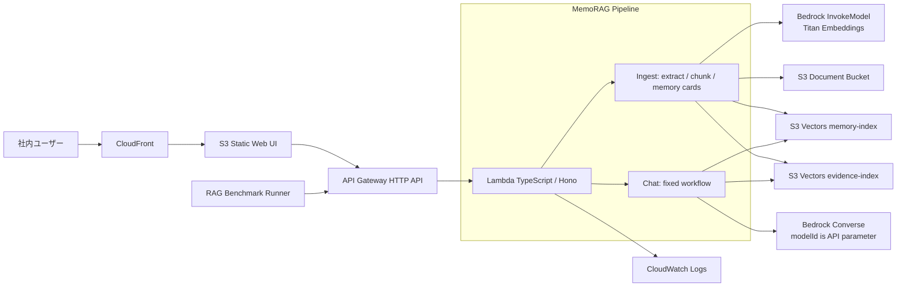

# MemoRAG Bedrock QA Chatbot MVP

社内資料だけを根拠に回答するQAチャットボットのMVPです。初期構築費用を抑えるため、AWS側は **API Gateway + Lambda + Amazon Bedrock + Amazon S3 + Amazon S3 Vectors + S3/CloudFront UI** のサーバレス構成にしています。ローカルではBedrockを呼ばず、モック埋め込みとファイルベースのベクトルストアで動作確認できます。

## UI方針

作成するUIは **1つ** です。資料アップロード、モデルID指定、チャット、引用チャンク表示、担当者対応、性能テストのジョブ起動と履歴確認を同じ画面にまとめています。ベンチマーク実行本体はUI内では処理せず、API、Step Functions、Runnerから非同期に呼び出します。

## アーキテクチャ



## MemoRAGとしての実装範囲

MVPでは、論文実装そのものではなく、MemoRAGの「グローバルメモリを作り、質問時に手がかりを生成して検索を改善する」構造を軽量に実装しています。

1. アップロード資料からチャンクを作成する。
2. 資料全体の `memory card`（要約、キーワード、想定質問、制約）を生成してベクトル化する。
3. 質問時はまず memory card を検索し、検索用の clues を生成する。
4. `clarification_gate` で、文書に grounded な複数候補がある曖昧質問だけ確認質問へ分岐する。
5. 元の質問と clues でチャンクを再検索し、検索後にも `clarification_gate` を通す。
6. `answerability_gate` と `sufficient_context_gate` で根拠不足を判定する。`PARTIAL` でも質問に直接必要な primary fact が支持されていれば取得済み根拠で回答生成へ進み、primary fact が不足または未解消 conflict の場合は回答生成前に `資料からは回答できません。` を返す。
7. 取得チャンクだけをコンテキストとして最終回答を生成し、引用IDを検証する。

実行制御は API 内の決定的なワークフローで行います。LLMに検索tool選択を任せず、`analyze_input -> normalize_query -> retrieve_memory -> generate_clues -> clarification_gate -> plan_search -> execute_search_action -> retrieval_evaluator -> clarification_gate -> evaluate_search_progress -> rerank_chunks -> answerability_gate -> sufficient_context_gate -> generate_answer/finalize_response/finalize_refusal/finalize_clarification` の順で進みます。RAG の検索件数、検索 budget、score 正規化、LLM judge / verifier の max tokens、confidence 閾値は `agent/runtime-policy.ts` に集約し、環境変数から運用調整します。

## API概要

Hono + `@hono/zod-openapi` でOpenAPIを生成します。

- `GET /health`
- `GET /openapi.json`
- `GET /documents`
- `POST /documents` 資料アップロード
- `POST /documents/uploads`、`POST /documents/uploads/{uploadId}/ingest` S3 経由の資料アップロード
- `POST /document-ingest-runs`、`GET /document-ingest-runs/{runId}`、`GET /document-ingest-runs/{runId}/events` S3 upload session 後の非同期資料取り込み
- `POST /documents/{documentId}/reindex` 資料再インデックス
- `GET /documents/reindex-migrations`、`POST /documents/{documentId}/reindex/stage`、`POST /documents/reindex-migrations/{migrationId}/cutover|rollback` blue-green 再インデックス切替
- `DELETE /documents/{documentId}` 資料削除
- `POST /chat` チャット回答
- `POST /chat-runs` 非同期チャット run 作成
- `GET /chat-runs/{runId}/events` 非同期チャット run の SSE 進捗・最終回答 streaming
- `POST /questions` 担当者への問い合わせ作成
- `GET /questions` 担当者問い合わせ一覧
- `GET /questions/{questionId}` 担当者問い合わせ詳細、または作成者本人向け回答確認
- `POST /questions/{questionId}/answer` 担当者回答登録
- `POST /questions/{questionId}/resolve` 問い合わせ解決済み化
- `GET /conversation-history` 自分の会話履歴一覧
- `POST /conversation-history` 会話履歴保存、お気に入り状態更新
- `DELETE /conversation-history/{id}` 会話履歴削除
- `GET /debug-runs` persisted debug trace一覧
- `GET /debug-runs/{runId}` persisted debug trace取得
- `POST /debug-runs/{runId}/download` persisted debug trace JSON download URL作成
- `POST /benchmark/query` ベンチマーク用。`/chat` と同じRAG処理をAPIから呼び出し、retrieval情報も返します。

OpenAPI 仕様の機械生成 Markdown は次のコマンドで更新します。生成先は上位 index の `docs/generated/openapi.md` と、API ごとの詳細ファイルを置く `docs/generated/openapi/` です。
`openapi.md` は API 一覧と詳細ファイルへのリンクを持ちます。各 API 詳細 Markdown は schema を JSON dump せず、headers、path parameters、query parameters、data、responses を表形式で出力します。operation summary / description、parameter description、request / response field description は日本語で記載します。生成済み `openapi.json` は commit せず、JSON 仕様は runtime の `GET /openapi.json` を source of truth とします。

```bash
npm run docs:openapi
```

日本語 summary / description と field description の不足は次の quality gate で検出します。

```bash
npm run docs:openapi:check
```

同じ処理は Taskfile からも実行できます。

```bash
task docs:openapi
task docs:openapi:check
```
- `POST /benchmark/search` search benchmark runner 用。`/search` と同じ hybrid search 処理を runner 権限で呼び出し、dataset 行の `user` を ACL 評価用の利用者文脈として扱います。
- `GET /benchmark-suites` 非同期ベンチマークで選択できる suite 一覧
- `POST /benchmark-runs` Step Functions + CodeBuild runner の非同期 benchmark run 起動
- `GET /benchmark-runs` benchmark run 履歴一覧
- `GET /benchmark-runs/{runId}` benchmark run 詳細
- `POST /benchmark-runs/{runId}/cancel` benchmark run キャンセル
- `POST /benchmark-runs/{runId}/download` benchmark report / summary / results / CodeBuild logs の download URL 作成
- `GET /benchmark-runs/{runId}/logs` CodeBuild ログ本文を `text/plain` の `.txt` として取得
- `GET/POST /admin/aliases`、`POST /admin/aliases/{aliasId}/review`、`POST /admin/aliases/publish` alias 管理 UI/API、review、versioned artifact publish
- `GET/POST /admin/users`、`POST /admin/users/{userId}/roles|suspend|unsuspend`、`DELETE /admin/users/{userId}` 管理対象ユーザー台帳
- `GET /admin/roles`、`GET /admin/audit-log`、`GET /admin/usage`、`GET /admin/costs` ロール、管理操作履歴、利用状況、概算コスト監査

管理画面は権限に応じて、文書管理、blue-green 再インデックス、alias review/publish、問い合わせ対応、debug/評価、benchmark、ユーザー/ロール、利用状況、コスト監査を表示します。

## ドキュメント

- [Requirements](docs/REQUIREMENTS.md): MVPの目的、機能要件、非機能要件、受け入れ条件。
- [Architecture Notes](docs/ARCHITECTURE.md): AWS構成、MemoRAG runtime、no-answer制御。
- [API Examples](docs/API_EXAMPLES.md): curlでのアップロード、チャット、benchmark query例。
- [Operations](docs/OPERATIONS.md): ローカル運用、環境変数、AWSデプロイ前チェック。
- [Local Verification](docs/LOCAL_VERIFICATION.md): ローカル検証手順と確認観点。
- [GitHub Actions Deploy](docs/GITHUB_ACTIONS_DEPLOY.md): OIDCを使ったGitHub ActionsからのCDK deploy手順。
- [Web UI Inventory](docs/generated/web-overview.md): Web UI の画面、機能、コンポーネント、主要操作要素の自動生成インベントリ。機能別詳細は `docs/generated/web-features/*.md` に分割しています。

Web UI インベントリは静的解析で生成します。更新は `npm run docs:web-inventory`、CI と同じ最新性確認は `npm run docs:web-inventory:check` を使います。初めて読む場合は `docs/generated/web-overview.md` から画面、機能、コンポーネントの順に辿ってください。条件付き表示、権限別表示、実行時データ依存の UI は生成物の `certainty` を確認してください。

## ローカル起動

```bash
npm install
cp .env.example .env
npm run dev:api
npm run dev:web
```

または Docker Compose:

```bash
docker compose up --build
```

- UI: http://localhost:5173
- API: http://localhost:8787
- OpenAPI: http://localhost:8787/openapi.json

ローカルでは `MOCK_BEDROCK=true` と `USE_LOCAL_VECTOR_STORE=true` によりAWSには接続しません。
ローカルUIは `VITE_AUTH_MODE=local` で起動し、Cognito の代わりにローカル開発用セッションを使います。本番デプロイでは CDK が `authMode: cognito` と Cognito 設定を `config.json` に配布します。

## AWSデプロイ

Bedrockの対象モデルを利用するリージョンで有効化してから実行してください。
同期 API の API Gateway integration timeout は 60 秒に設定しているため、デプロイ前に対象AWSアカウント / リージョンの API Gateway quota `Maximum integration timeout in milliseconds` を 60,000ms 以上へ引き上げてください。未設定の場合、`AWS::ApiGateway::Method` の更新が `Timeout should be between 50 ms and 29000 ms` で失敗します。詳細は [GitHub Actions Deploy](docs/GITHUB_ACTIONS_DEPLOY.md) を参照してください。

```bash
npm install
npm run build -w @memorag-mvp/web
npm run build -w @memorag-mvp/infra
npm run cdk -w @memorag-mvp/infra -- bootstrap
npm run cdk -w @memorag-mvp/infra -- deploy
```

Taskfileを使う場合は `task cdk:deploy` でフロントエンドbuild、Lambda bundle、CDK deployを順に実行します。

GitHub Actionsでは `.github/workflows/memorag-ci.yml` がpull requestで lint、typecheck、test、build、cdk-nag有効状態のCDK synthを実行します。デプロイは `.github/workflows/memorag-deploy.yml` を使います。AWS側のOIDC RoleとGitHub secret `AWS_DEPLOY_ROLE_ARN` を設定してください。
OpenAPI 生成ドキュメントは `.github/workflows/memorag-openapi-docs.yml` が main push または手動実行で `npm run docs:openapi` を実行し、差分がある場合は `docs/generated/openapi.md` と `docs/generated/openapi/` の更新 PR を作成します。生成済み JSON は commit 対象にしません。
OpenAPI summary / description の品質 gate は `.github/workflows/memorag-ci.yml` と `.github/workflows/memorag-openapi-docs.yml` の両方で `npm run docs:openapi:check` として実行され、不足がある場合は CI を失敗させます。
デプロイ後の Cognito ユーザー追加は、ログイン画面からのアカウント作成、または `.github/workflows/memorag-create-cognito-user.yml` の手動実行で行えます。管理者設定のユーザー管理一覧は Cognito User Pool の全ユーザーを読み取り、管理台帳とマージして表示します。管理画面上のロール付与は Cognito group へ反映し、管理台帳にも監査用 snapshot として記録します。停止、再開、削除状態は管理台帳を source of truth とし、実際の API 認可はログイン時の Cognito group を含む JWT で判定します。

デプロイ後、CDK Outputs にAPI URLとCloudFront URLが出ます。

### Cognitoユーザー作成

デプロイ後の Cognito User Pool にユーザーを追加するには、AWS CLI の認証情報を設定したうえで次を実行します。

```bash
infra/scripts/create-cognito-user.sh \
  --email alice@example.com \
  --password 'ExamplePassw0rd!' \
  --role 一般利用者 \
  --role 回答担当者 \
  --suppress-invite
```

`--role` は複数回指定できます。ロールは `一般利用者`、`回答担当者`、`RAGグループ管理者`、`性能テスト担当者`、`ベンチマークAPI実行サービス`、`ユーザー管理者`、`アクセス管理者`、`コスト監査者`、`システム管理者` の日本語名、または `CHAT_USER`、`ANSWER_EDITOR`、`RAG_GROUP_MANAGER`、`BENCHMARK_OPERATOR`、`BENCHMARK_RUNNER`、`USER_ADMIN`、`ACCESS_ADMIN`、`COST_AUDITOR`、`SYSTEM_ADMIN` の Cognito group 名で指定できます。
`--user-pool-id` を省略した場合は、CloudFormation stack `MemoRagMvpStack` の `CognitoUserPoolId` output から取得します。通常利用者は `CHAT_USER`、担当者は `ANSWER_EDITOR`、性能テストを管理画面から起動する運用者は `BENCHMARK_OPERATOR`、CodeBuild runner の service user は `BENCHMARK_RUNNER`、debug trace や benchmark 成果物を管理する管理者は `SYSTEM_ADMIN` または `システム管理者` を指定してください。`BENCHMARK_RUNNER` は `/benchmark/query` と `/benchmark/search` 用であり、管理画面から run を起動する権限ではありません。作成済みユーザーは、初回ログイン前でも管理者設定のユーザー管理一覧に表示されます。
`CHAT_USER` などの Cognito group は CDK stack で作成されるため、ユーザー作成前に `npm run cdk -w @memorag-mvp/infra -- deploy` または `task cdk:deploy` を実行してください。
ログイン画面から作成したユーザーは、メール確認後に Cognito post-confirmation trigger により `CHAT_USER` のみ自動付与されます。担当者、管理、監査、`SYSTEM_ADMIN` などの上位権限は、管理ユーザーが GitHub Actions または AWS 管理手順で後から付与してください。
GitHub Actions から作成する場合は、`Actions` -> `Create MemoRAG Cognito User` -> `Run workflow` でメールアドレスと主ロールを日本語名で選択します。追加ロールが必要な場合は、`additional-roles` に日本語名または Cognito group 名をカンマ区切りで入力します。

## API実行例

```bash
curl -s http://localhost:8787/documents \
  -H 'Content-Type: application/json' \
  -d '{"fileName":"handbook.md","text":"経費精算は申請から30日以内に行う必要があります。"}'

curl -s http://localhost:8787/chat \
  -H 'Content-Type: application/json' \
  -d '{"question":"経費精算の期限は？","modelId":"amazon.nova-lite-v1:0"}' | jq
```

新しい UI は `POST /chat-runs` で非同期 run を作成し、`GET /chat-runs/{runId}/events` を `fetch` stream で読みます。既存 `POST /chat` は後方互換の同期 JSON API として残します。
ファイルアップロード UI は S3 upload session へ転送したあと `POST /document-ingest-runs` で非同期 ingest run を開始し、run 状態を取得して完了 manifest を受け取ります。既存 `POST /documents` と `POST /documents/uploads/{uploadId}/ingest` は後方互換の同期 API として残します。

## ベンチマーク

管理画面の「性能テスト」は `POST /benchmark-runs` で非同期 run を作成し、Step Functions が CodeBuild runner を起動します。run 状態、成果物キー、CodeBuild log URL、CloudWatch Logs の group / stream は DynamoDB、dataset と `results.jsonl` / `summary.json` / `report.md` は benchmark 用 S3 bucket に保存します。管理画面は履歴表示、キャンセル、成功 run の report / summary / raw results download URL 作成、失敗時を含む CodeBuild logs の `.txt` ダウンロードを担当します。ログ本文は `GET /benchmark-runs/{runId}/logs` で `benchmark:download` 権限の範囲内だけ取得できます。

CodeBuild runner が本番 API を叩くための認証 token は、CDK が作成する Secrets Manager secret と `BENCHMARK_RUNNER` service user から自動取得します。管理者が管理画面で token を入力する必要はありません。外部管理の secret を使いたい場合だけ、CDK context `benchmarkRunnerAuthSecretId` に Secrets Manager secret ID を渡します。secret は `username` / `password`、または `idToken` / `token` を持てます。`username` / `password` 認証で token 解決に失敗した場合、CodeBuild runner は benchmark を継続せず失敗します。agent mode は `/benchmark/query`、search mode は `/benchmark/search` を呼びます。

`smoke-agent-v1`、`standard-agent-v1`、`clarification-smoke-v1`、`search-smoke-v1`、`search-standard-v1` の runner は、実行前に同じ `BENCHMARK_CORPUS_SUITE_ID` の benchmark seed 文書を削除し、`benchmark/corpus/standard-agent-v1/handbook.md` を再アップロードして、active chunk が作成されたことを確認してから `/benchmark/query` または `/benchmark/search` を実行します。削除または再アップロードに失敗した場合、古い corpus で測定を継続せず runner は失敗します。PDF corpus は `/documents/uploads` で発行した S3 upload URL に転送してから `POST /document-ingest-runs` で非同期 ingest run を開始し、`GET /document-ingest-runs/{runId}` を polling して完了 manifest の active chunk を確認します。これにより API Gateway/Lambda の JSON body size 制限に大きな PDF を載せず、Textract OCR fallback の完了待ちも同期 API timeout から切り離します。polling 間隔は `BENCHMARK_INGEST_RUN_POLL_INTERVAL_MS`、最大待機時間は `BENCHMARK_INGEST_RUN_TIMEOUT_MS` で調整できます。抽出可能なテキストがない PDF、または async ingest run が Textract OCR timeout を返した PDF は `skipped_unextractable` として summary / report の corpus seed に記録し、agent benchmark ではその file を期待する dataset row を `skippedRows` に移して評価対象から除外します。その他の worker failure や run polling 失敗は古い corpus で測定を継続せず runner fatal とします。`mmrag-docqa-v1` は CodeBuild pre_build で Hugging Face `yubo2333/MMLongBench-Doc` train split の全 1,091 questions を JSONL 化し、参照 PDF を一時 corpus に download してから `MMRAG-DocQA` として起動します。seed 文書は `aclGroups: ["BENCHMARK_RUNNER"]` と `docType: "benchmark-corpus"` で隔離し、通常利用者の RAG 検索・回答・文書一覧には混入させません。同じ source hash、per-file metadata、ingest signature の seed 済み資料が active な場合は再アップロードを省略します。corpus seed の削除・アップロード時間は runner setup であり、summary の p50/p95/average latency は初回 `/benchmark/query` または `/benchmark/search` API call を対象にします。任意の corpus を使う場合は `BENCHMARK_CORPUS_DIR` を指定してください。同じ corpus を複数 suite で共有する場合は `BENCHMARK_CORPUS_SUITE_ID` で seed 判定用の corpus identity を固定できます。`<file>.metadata.json` を置くと benchmark seed 文書に `searchAliases` を付与でき、search benchmark の alias case で使えます。

CDK deploy 時に benchmark 用 S3 bucket へ `datasets/agent/smoke-v1.jsonl`、`datasets/agent/standard-v1.jsonl`、`datasets/agent/clarification-smoke-v1.jsonl`、`datasets/search/smoke-v1.jsonl`、`datasets/search/standard-v1.jsonl` を配置します。管理画面の `clarification-smoke-v1` suite は `benchmark/dataset.clarification.sample.jsonl` を元にします。`benchmark/dataset.rag-baseline.sample.jsonl` と `benchmark/corpus/rag-baseline-v1/` は、answerable / unanswerable / ambiguous / table / multi-doc / ACL の6分類を含むローカル baseline evaluation set です。`mmrag-docqa-v1` suite は S3 配置済み sample ではなく `npm run prepare:mmrag-docqa -w @memorag-mvp/benchmark` で全量 dataset と corpus を準備します。ローカルで軽量な導線だけを見る場合に限り、`benchmark/dataset.mmrag-docqa.sample.jsonl` と `benchmark/corpus/mmrag-docqa-v1/` を手動指定できます。

```bash
API_BASE_URL=http://localhost:8787 \
API_AUTH_TOKEN=<optional-bearer-token> \
DATASET=benchmark/dataset.sample.jsonl \
OUTPUT=.local-data/benchmark-results.jsonl \
SUMMARY=.local-data/benchmark-summary.json \
REPORT=.local-data/benchmark-report.md \
BENCHMARK_SUITE_ID=standard-agent-v1 \
BENCHMARK_CORPUS_DIR=benchmark/corpus/standard-agent-v1 \
BENCHMARK_CORPUS_SUITE_ID=standard-agent-v1 \
npm run start -w @memorag-mvp/benchmark
```

baseline evaluation set をローカルで測る場合は、`task benchmark:rag-baseline:sample` を使うか、`DATASET=benchmark/dataset.rag-baseline.sample.jsonl`、`BENCHMARK_SUITE_ID=rag-baseline-v1`、`BENCHMARK_CORPUS_DIR=benchmark/corpus/rag-baseline-v1`、`BENCHMARK_CORPUS_SUITE_ID=rag-baseline-v1` を指定します。この dataset は改善前後の比較基準用であり、RAG 実装側に row ID、期待語句、dataset 固有分岐を入れてはいけません。

建築・AEC 図面理解向けの QARAG 評価企画と 82 件の seed QA は [`benchmark/architecture-drawing-qarag-v0.1.md`](benchmark/architecture-drawing-qarag-v0.1.md) で Markdown 管理します。この v0.1 は国土交通省標準図と自治体公開図面を使った初期評価設計であり、現時点では runner 用 JSONL suite には組み込んでいません。

検索 benchmark は `npm run start:search -w @memorag-mvp/benchmark` または `task benchmark:search:sample` で実行します。sample task は `BENCHMARK_SUITE_ID=search-standard-v1` と同じ corpus seed を指定します。

`OUTPUT` には行ごとのAPI応答と評価結果、`SUMMARY` には集計JSON、`REPORT` にはMarkdownレポートが出力されます。agent benchmark report には `retrieval_mrr_at_k`、`citation_support_pass_rate`、`no_access_leak_count`、`no_access_leak_rate`、失敗行の failure category も出力されます。

Allganize の日本語公開データセット `allganize/RAG-Evaluation-Dataset-JA` は、CSV を既存 runner 用 JSONL へ変換し、`documents.csv` に含まれる source PDF を corpus として download してから実行します。既定では `target_answer` は `referenceAnswer` として results に残し、完全一致の正答判定には使いません。保守的な完全包含判定も行う場合は `ALLGANIZE_RAG_EXPECTED_MODE=strict-contains` を指定してください。

```bash
ALLGANIZE_RAG_LIMIT=10 \
task benchmark:allganize:ja
```

管理画面の `allganize-rag-evaluation-ja-v1` suite は CodeBuild runner 内で同じ変換と download を行います。source PDF URL が移動または削除されている場合は NDL WARP の最新アーカイブも試行します。Hugging Face、各 source PDF URL、NDL WARP のいずれにも到達できない環境では、dataset 準備段階で失敗します。download できた PDF でも抽出可能なテキストがない場合は、該当 corpus とその corpus を期待資料にする row を skip として artifact に記録し、残りの row を評価します。

JSONL datasetの1行は次の形式です。`expected` だけでも動きますが、`answerable`、`expectedContains`、`expectedFiles` を指定すると正答率、拒否率、citation/file hit rateまで測定できます。

```json
{"id":"q1","question":"経費精算の期限は？","answerable":true,"expectedContains":["30日以内"],"expectedFiles":["handbook.md"]}
```

## 注意点

- PDF は `pdf-parse` と `pdftotext -layout` の良い方を採用し、embedded text が取れない PDF は `PDF_OCR_FALLBACK_ENABLED=true` の API Lambda で Amazon Textract OCR fallback を試します。DOCX は `mammoth` HTML 変換から heading/list/table/code/figure caption を structured block 化します。Textract JSON は `textractJson` または `.textract.json` 入力を受け、table/list/figure を専用 chunk として正規化します。通常 text は段落、文、箇条書きなどの意味単位を優先して chunk 化し、長すぎる単位だけ `chunkSize` に収まるよう fallback split します。
- S3 Vectorsのインデックス次元は作成後に変更できないため、`EMBEDDING_DIMENSIONS` と埋め込みモデルを先に決めてください。デフォルトはTitan Text Embeddings V2の1024次元です。
- 回答拒否は検索スコア閾値、answerability gate、sufficient-context judge、citation / support verifier で行います。`sufficient-context judge` の `PARTIAL` は即拒否ではなく、primary fact の支持状況と missing / conflicting fact の必要度で回答継続可否を決めます。各閾値と LLM 呼び出し設定は環境変数で調整し、MVP段階でもコード内の固定値に依存しない運用を前提にします。必要ならBedrock Guardrailsや別モデルによるgroundedness judgeを追加してください。
- AWS月額の初期目安は、小規模検証で `$2-5`、社内MVPで `$25-35`、活発なpilotで `$200-250` です。詳細な前提、リソース一覧、コスト制御方針は [Architecture Notes](docs/ARCHITECTURE.md) を参照してください。
