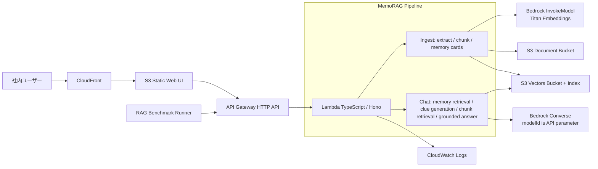

# MemoRAG Bedrock QA Chatbot MVP

社内資料だけを根拠に回答するQAチャットボットのMVPです。初期構築費用を抑えるため、AWS側は **API Gateway + Lambda + Amazon Bedrock + Amazon S3 + Amazon S3 Vectors + S3/CloudFront UI** のサーバレス構成にしています。ローカルではBedrockを呼ばず、モック埋め込みとファイルベースのベクトルストアで動作確認できます。

## UI方針

作成するUIは **1つ** です。資料アップロード、モデルID指定、チャット、引用チャンク表示を同じ画面にまとめています。ベンチマークや自動評価はUIではなくAPIから呼び出す前提です。

## アーキテクチャ



## MemoRAGとしての実装範囲

MVPでは、論文実装そのものではなく、MemoRAGの「グローバルメモリを作り、質問時に手がかりを生成して検索を改善する」構造を軽量に実装しています。

1. アップロード資料からチャンクを作成する。
2. 資料全体の `memory card`（要約、キーワード、想定質問、制約）を生成してベクトル化する。
3. 質問時はまず memory card を検索し、検索用の clues を生成する。
4. 元の質問と clues でチャンクを再検索する。
5. 取得チャンクだけをコンテキストとして最終回答を生成する。
6. 検索スコアが閾値未満、またはモデルが根拠不足と判定した場合は `資料からは回答できません。` を返す。

## API概要

Hono + `@hono/zod-openapi` でOpenAPIを生成します。

- `GET /health`
- `GET /openapi.json`
- `GET /documents`
- `POST /documents` 資料アップロード
- `DELETE /documents/{documentId}` 資料削除
- `POST /chat` チャット回答
- `POST /benchmark/query` ベンチマーク用。`/chat` と同じRAG処理をAPIから呼び出し、retrieval情報も返します。

## ドキュメント

- [Requirements](docs/REQUIREMENTS.md): MVPの目的、機能要件、非機能要件、受け入れ条件。
- [Architecture Notes](docs/ARCHITECTURE.md): AWS構成、MemoRAG runtime、no-answer制御。
- [API Examples](docs/API_EXAMPLES.md): curlでのアップロード、チャット、benchmark query例。
- [Operations](docs/OPERATIONS.md): ローカル運用、環境変数、AWSデプロイ前チェック。
- [Local Verification](docs/LOCAL_VERIFICATION.md): ローカル検証手順と確認観点。
- [GitHub Actions Deploy](docs/GITHUB_ACTIONS_DEPLOY.md): OIDCを使ったGitHub ActionsからのCDK deploy手順。

## ローカル起動

```bash
npm install
cp .env.example .env
npm run dev:api
npm run dev:web
```

または Docker Compose:

```bash
docker compose up --build
```

- UI: http://localhost:5173
- API: http://localhost:8787
- OpenAPI: http://localhost:8787/openapi.json

ローカルでは `MOCK_BEDROCK=true` と `USE_LOCAL_VECTOR_STORE=true` によりAWSには接続しません。

## AWSデプロイ

Bedrockの対象モデルを利用するリージョンで有効化してから実行してください。

```bash
npm install
npm run build -w @memorag-mvp/web
npm run build -w @memorag-mvp/infra
npm run cdk -w @memorag-mvp/infra -- bootstrap
npm run cdk -w @memorag-mvp/infra -- deploy
```

Taskfileを使う場合は `task cdk:deploy` でフロントエンドbuild、Lambda bundle、CDK deployを順に実行します。

GitHub Actionsからの手動デプロイは `.github/workflows/deploy.yml` を使います。AWS側のOIDC RoleとGitHub secret `AWS_DEPLOY_ROLE_ARN` を設定してください。

デプロイ後、CDK Outputs にAPI URLとCloudFront URLが出ます。

## API実行例

```bash
curl -s http://localhost:8787/documents \
  -H 'Content-Type: application/json' \
  -d '{"fileName":"handbook.md","text":"経費精算は申請から30日以内に行う必要があります。"}'

curl -s http://localhost:8787/chat \
  -H 'Content-Type: application/json' \
  -d '{"question":"経費精算の期限は？","modelId":"amazon.nova-lite-v1:0"}' | jq
```

## ベンチマーク

```bash
API_BASE_URL=http://localhost:8787 \
DATASET=benchmark/dataset.sample.jsonl \
OUTPUT=.local-data/benchmark-results.jsonl \
npm run start -w @memorag-mvp/benchmark
```

JSONLの1行は次の形式です。

```json
{"id":"q1","question":"経費精算の期限は？","expected":"30日以内"}
```

## 注意点

- MVPのPDF/DOCX抽出は `pdf-parse` と `mammoth` による簡易実装です。社内規程・契約書などの本番投入では、Textractや文書変換パイプラインを別途検討してください。
- S3 Vectorsのインデックス次元は作成後に変更できないため、`EMBEDDING_DIMENSIONS` と埋め込みモデルを先に決めてください。デフォルトはTitan Text Embeddings V2の1024次元です。
- 回答拒否は検索スコア閾値とプロンプト制約で行っています。MVP評価後、必要ならBedrock Guardrailsや別モデルによるgroundedness judgeを追加してください。
