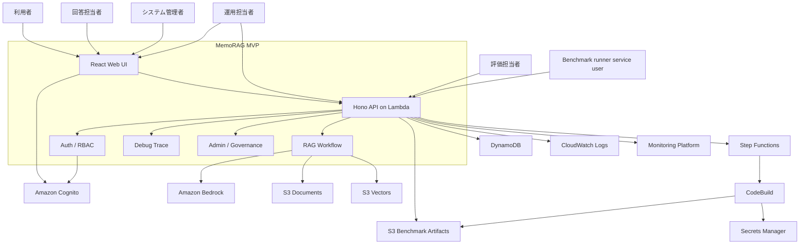

# MemoRAG MVP システムコンテキスト

- ファイル: `memorag-bedrock-mvp/docs/2_アーキテクチャ_ARC/01_コンテキスト_CONTEXT/ARC_CONTEXT_001.md`
- 種別: `ARC_CONTEXT`
- 作成日: 2026-05-01
- 状態: Draft

## 何を書く場所か

MemoRAG MVP のシステム境界、外部アクター、依存サービス、入出力、信頼境界を定義する。

## システム概要

MemoRAG MVP は、利用者がアップロードした文書を検索可能な memory/evidence として保持し、質問に対して根拠付き回答または回答不能理由を返す RAG システムである。

## 外部アクター

| アクター | 主な操作 | 対応する機能要求 L1 | 関心事 |
| --- | --- | --- | --- |
| 一般利用者 | 文書参照、質問、回答確認、会話履歴、お気に入り、問い合わせ送信 | 2, 5, 6 | 正確性、根拠、回答不能時の説明 |
| 回答担当者 | 問い合わせ一覧確認、回答登録、解決済み化 | 6, 8 | 担当者導線の権限分離、対応履歴 |
| 評価担当者 | benchmark 実行、評価結果取得 | 7 | 再現性、品質指標、データセット管理 |
| 運用担当者 | debug trace、benchmark 履歴、文書管理、alias 管理 | 1, 3, 7, 8 | 調査性、コスト、復旧容易性 |
| システム管理者 | ユーザー、ロール、監査、利用状況、コスト確認 | 8 | 管理 API の最小権限、監査可能性 |
| セキュリティ管理者 | 認可方針、ACL、監査確認 | 8 | 権限外露出防止、監査可能性 |
| Benchmark runner service user | `/benchmark/query` 実行、成果物保存 | 7 | UI 非依存評価、credential 管理 |
| Cognito self sign-up 利用者 | アカウント作成、メール確認、初回 sign-in | 8 | `CHAT_USER` のみの初期権限 |
| 開発者 | ローカル検証、機能改修、設計更新 | 横断 | 変更容易性、テスト容易性 |

## 外部依存

| 依存先 | 用途 | 失敗時の扱い |
| --- | --- | --- |
| Amazon Bedrock | clue 生成、embedding、回答生成、judge | 回答生成または評価を失敗として trace に残す |
| Amazon Cognito | sign-in、self sign-up、Cognito group 管理 | 未認証または権限不足として扱い、管理 API は実行しない |
| DynamoDB | human question、conversation history、benchmark run、管理台帳 | 対象機能の保存または参照失敗として扱い、userId 境界を越えて代替しない |
| S3 Documents | source、manifest、debug-runs の保存 | 文書登録、回答、trace 参照を失敗として扱う |
| S3 Vectors | memory/evidence vector search | 検索失敗として扱い、推測回答しない |
| S3 Benchmark Artifacts | dataset、results、summary、report 保存 | benchmark 成果物の保存または取得失敗として扱う |
| Step Functions | 非同期 benchmark run orchestration | benchmark run を失敗または保留として扱う |
| CodeBuild | benchmark runner 実行 | runner 実行失敗として run status と logs に残す |
| Secrets Manager | benchmark runner service user credential | benchmark runner 起動を拒否し、credential をログへ出さない |
| CloudWatch Logs | API、runner、Lambda の運用ログ | 調査性低下として扱い、API 応答の根拠には使わない |
| API Gateway | API 公開 | 呼び出し失敗としてクライアントへ返す |
| CloudFront / S3 Frontend | UI 配信 | API には影響しないが利用者操作を阻害する |

## 入出力

| 種別 | 入力 | 出力 |
| --- | --- | --- |
| 文書取り込み | 文書本文、ファイル名、メタデータ | documentId、manifest、memory/evidence record |
| 質問応答 | question、modelId、search settings | answer、citations、answerability、debug metadata |
| 評価 | dataset case、API base URL、評価設定 | JSONL 結果、summary、Markdown report |
| 調査 | runId、日付、権限情報 | debug trace、retrieval results、model metadata |

## 信頼境界

- Browser と API の境界では、認証・認可・入力検証を API 側で実施する。
- API と Bedrock の境界では、プロンプトに入れる文書断片を検索済み evidence に限定する。
- API と S3 Vectors の境界では、検索対象 index と metadata filter を設計上の制御点とする。
- benchmark/debug 系 API は、本番または社内検証環境では認可対象とする。
- Cognito と API の境界では、ID token の検証と group-to-permission 変換を API 側で行う。
- 通常利用者と管理 API の境界では、UI 表示制御ではなく route-level permission を強制境界とする。
- 会話履歴とお気に入りは userId 境界に閉じ、別 userId の履歴として返さない。
- 問い合わせ送信は通常利用者導線、問い合わせ一覧・回答登録は担当者導線として分離する。
- alias artifact、ACL metadata、debug trace は通常検索 response に漏えいさせない。

## 前提・制約

- 初期検索基盤は `TC-001` に従い、OpenSearch 完全互換を目指さない。
- 最終回答の根拠は raw evidence chunk に限定する。
- 高抽象度 memory は検索補助であり、最終回答の引用根拠にはしない。
