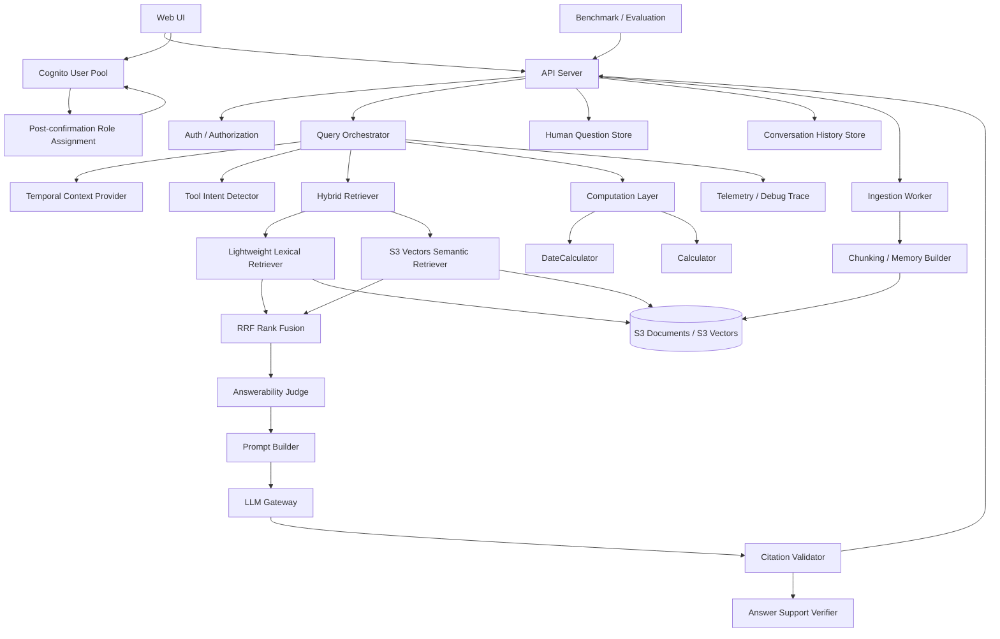
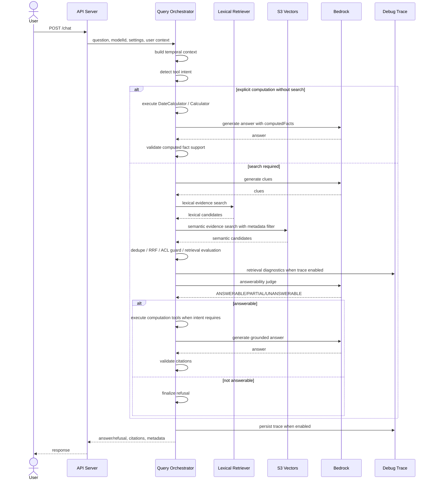

# MemoRAG MVP RAG パイプラインビュー

- ファイル: `memorag-bedrock-mvp/docs/2_アーキテクチャ_ARC/11_ビュー_VIEW/ARC_VIEW_001.md`
- 種別: `ARC_VIEW`
- 作成日: 2026-05-01
- 状態: Draft

## 何を書く場所か

MemoRAG MVP の論理ビュー、ランタイムビュー、データ配置ビューを記述する。

## ビューの目的

要件、アーキテクチャ決定、詳細設計を接続するため、RAG の主要構造と実行時の責務分担を明確にする。

## 論理ビュー

## 構成要素

| 要素 | 責務 |
| --- | --- |
| Web UI | 文書登録、質問、回答、引用、担当者問い合わせ、会話履歴、debug trace 参照の操作面を提供する。 |
| Cognito User Pool | sign-in、self sign-up、確認コード検証、Cognito group を管理する。 |
| Post-confirmation Role Assignment | self sign-up 確認済みユーザーへ `CHAT_USER` のみを付与する。 |
| API Server | API 受付、認可、RAG workflow 呼び出し、レスポンス整形を行う。 |
| Auth / Authorization | Cognito ID token の group から API permission を判定する。 |
| Query Orchestrator | 検索、tool intent、deterministic computation、回答可能性判定、回答生成、引用検証、trace 記録を制御する。 |
| Temporal Context Provider | API サーバー時刻または質問文の明示基準日から `today`、timezone、source を決定する。 |
| Tool Intent Detector | 検索、日付計算、数値計算、全件列挙の要否を intent として判定する。 |
| Hybrid Retriever | 通常チャットの evidence 検索で lexical retrieval、semantic search、RRF、ACL guard、diagnostics 生成を束ねる。 |
| Lightweight Lexical Retriever | BM25、CJK n-gram、prefix、ASCII fuzzy、alias expansion で語句一致候補を取得する。 |
| S3 Vectors Semantic Retriever | query embedding と metadata filter により意味検索候補を取得する。 |
| RRF Rank Fusion | 複数 clue、query、retrieval source の evidence 検索結果を順位融合する。 |
| Computation Layer | `computedFacts` を生成し、LLM に計算を再実行させず回答生成前に計算結果を確定する。 |
| DateCalculator | 残日数、期限切れ、本日期限、超過日数、calendar day 加算を deterministic に計算する。 |
| Calculator | 明示的な金額・人数・期間の MVP 数値計算を deterministic に実行する。 |
| Answerability Judge | 検索済み evidence だけで回答可能かを判定する。 |
| Prompt Builder | document evidence、computed facts、質問、回答制約を LLM prompt に変換する。 |
| LLM Gateway | Bedrock model 呼び出しを集中管理する。 |
| Citation Validator | 回答文の document citation と `usedComputedFactIds` の妥当性を検証する。 |
| Answer Support Verifier | 回答中の文書由来主張と計算由来主張が、それぞれ document evidence または computed fact で支持されるか検証する。 |
| Benchmark / Evaluation | fact coverage、faithfulness、context relevance、不回答精度を測定する。 |
| Human Question Store | RAG が回答できない質問を担当者対応 ticket として保持する。 |
| Conversation History Store | userId 単位の会話履歴を保持する。 |

## ランタイムビュー

## データ配置ビュー

| データ | AWS | ローカル |
| --- | --- | --- |
| source | `documents/<documentId>/source.txt` | `.local-data/documents/<documentId>/source.txt` |
| manifest | `manifests/<documentId>.json` | `.local-data/manifests/<documentId>.json` |
| debug trace | `debug-runs/<yyyy-mm-dd>/<runId>.json` | `.local-data/debug-runs/<yyyy-mm-dd>/<runId>.json` |
| human question | DynamoDB question table | `.local-data/questions.json` |
| conversation history | DynamoDB conversation history table | `.local-data/conversation-history.json` |
| memory vectors | `memory-index` | `.local-data/memory-vectors.json` |
| evidence vectors | `evidence-index` | `.local-data/evidence-vectors.json` |

## ビューから見えるリスク

- LLM judge を常時実行するとレイテンシとコストが増える。
- debug trace に質問、文書断片、モデル出力が含まれるため認可が必要である。
- RRF と再検索を追加すると ranking の説明責任が増えるため、actionHistory と score を trace に残す必要がある。
- hybrid retrieval を通常チャット本線へ入れると latency と trace 情報量が増えるため、retrievalDiagnostics に query 数、source 件数、version 情報を残して評価で調整する必要がある。
- 日付・数値計算を LLM の暗算に任せると誤答や support verifier の誤判定につながるため、計算結果は `computedFacts` として回答生成前に確定し、document evidence と区別して検証する必要がある。
- 「全部出して」「一覧にして」の期限タスク質問を RAG topK で処理すると漏れが出るため、構造化インデックス未実装の間は完全一覧不可を明示する必要がある。
- 通常利用者の UI が担当者一覧や debug trace 一覧を事前取得すると不要な 403 と権限過多を招くため、Cognito group に応じて取得対象を分ける必要がある。
- self sign-up を許可すると任意メールアドレスの登録試行が増えるため、Cognito 確認コードと `CHAT_USER` のみの自動付与で初期権限を抑える必要がある。
