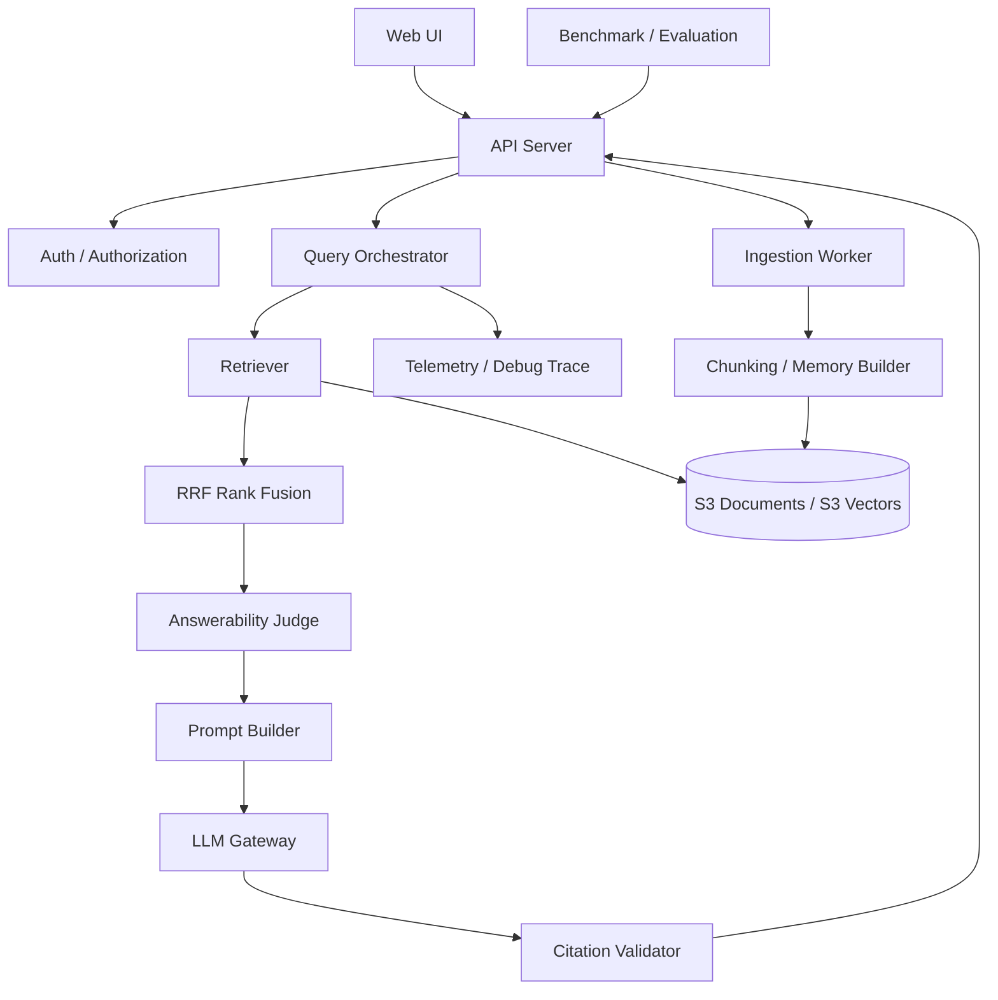
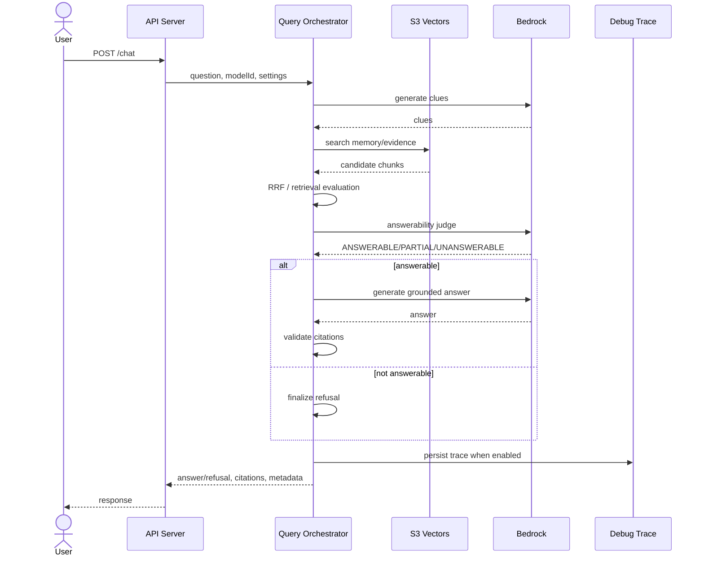

# MemoRAG MVP RAG パイプラインビュー

- ファイル: `memorag-bedrock-mvp/docs/2_アーキテクチャ_ARC/11_ビュー_VIEW/ARC_VIEW_001.md`
- 種別: `ARC_VIEW`
- 作成日: 2026-05-01
- 状態: Draft

## 何を書く場所か

MemoRAG MVP の論理ビュー、ランタイムビュー、データ配置ビューを記述する。

## ビューの目的

要件、アーキテクチャ決定、詳細設計を接続するため、RAG の主要構造と実行時の責務分担を明確にする。

## 論理ビュー

## 構成要素

| 要素 | 責務 |
| --- | --- |
| Web UI | 文書登録、質問、回答、引用、debug trace 参照の操作面を提供する。 |
| API Server | API 受付、認可、RAG workflow 呼び出し、レスポンス整形を行う。 |
| Query Orchestrator | 検索、回答可能性判定、回答生成、引用検証、trace 記録を制御する。 |
| Retriever | memory/evidence index から候補を取得する。 |
| RRF Rank Fusion | 複数 clue または query の evidence 検索結果を順位融合する。 |
| Answerability Judge | 検索済み evidence だけで回答可能かを判定する。 |
| Prompt Builder | evidence、質問、回答制約を LLM prompt に変換する。 |
| LLM Gateway | Bedrock model 呼び出しを集中管理する。 |
| Citation Validator | 回答文と引用 chunk の支持関係を検証する。 |
| Benchmark / Evaluation | fact coverage、faithfulness、context relevance、不回答精度を測定する。 |

## ランタイムビュー

## データ配置ビュー

| データ | AWS | ローカル |
| --- | --- | --- |
| source | `documents/<documentId>/source.txt` | `.local-data/documents/<documentId>/source.txt` |
| manifest | `manifests/<documentId>.json` | `.local-data/manifests/<documentId>.json` |
| debug trace | `debug-runs/<yyyy-mm-dd>/<runId>.json` | `.local-data/debug-runs/<yyyy-mm-dd>/<runId>.json` |
| memory vectors | `memory-index` | `.local-data/memory-vectors.json` |
| evidence vectors | `evidence-index` | `.local-data/evidence-vectors.json` |

## ビューから見えるリスク

- LLM judge を常時実行するとレイテンシとコストが増える。
- debug trace に質問、文書断片、モデル出力が含まれるため認可が必要である。
- RRF と再検索を追加すると ranking の説明責任が増えるため、actionHistory と score を trace に残す必要がある。
