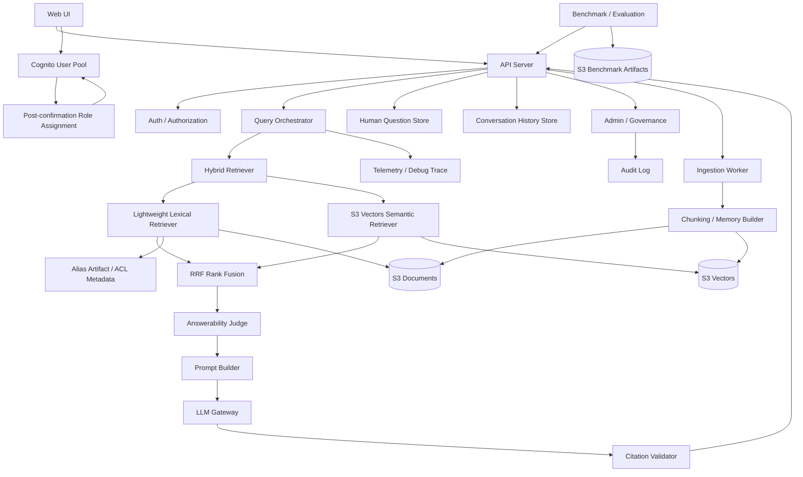
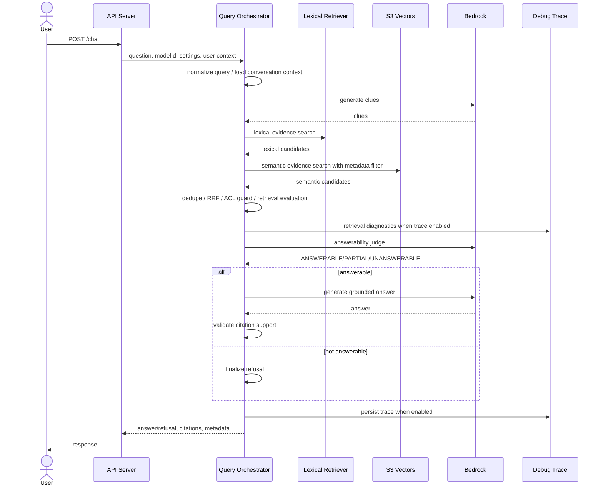

# MemoRAG MVP アーキテクチャビュー索引

- ファイル: `memorag-bedrock-mvp/docs/2_アーキテクチャ_ARC/11_ビュー_VIEW/ARC_VIEW_001.md`
- 種別: `ARC_VIEW`
- 作成日: 2026-05-01
- 状態: Draft

## 何を書く場所か

MemoRAG MVP の論理コンポーネント、RAG ランタイム、データ、認証認可、デプロイメント、運用評価のビューを索引する。

## ビューの目的

要件、アーキテクチャ決定、詳細設計を接続するため、RAG の主要構造と実行時の責務分担を明確にする。

## ビュー一覧

| ビュー | 主な関心事 | 対応する機能要求 L1 |
| --- | --- | --- |
| 論理コンポーネントビュー | 主要コンポーネントと責務 | 1, 2, 3, 4, 6, 8 |
| RAG ランタイムビュー | chat / retrieval / answerability / citation | 2, 3, 4 |
| データ・インデックスライフサイクルビュー | document、memory、evidence、alias、history、question、trace、benchmark artifact | 1, 3, 5, 6, 7, 8 |
| 認証認可・信頼境界ビュー | Cognito、RBAC、admin API、ACL、userId boundary | 5, 6, 7, 8 |
| デプロイメントビュー | AWS サーバレス構成 | 横断 |
| 運用・評価ビュー | debug trace、benchmark、monitoring、usage / cost audit | 7, 8 |

現時点では詳細ビューを本ファイルに集約する。分割時は `ARC_VIEW_011_論理コンポーネント.md`、`ARC_VIEW_021_RAGランタイム.md`、`ARC_VIEW_031_データ・インデックスライフサイクル.md`、`ARC_VIEW_041_認証認可・信頼境界.md`、`ARC_VIEW_051_デプロイメント.md`、`ARC_VIEW_061_運用・評価.md` へ移す。

## 論理ビュー

## 構成要素

| 要素 | 責務 |
| --- | --- |
| Web UI | 文書登録、質問、回答、引用、担当者問い合わせ、会話履歴、debug trace 参照の操作面を提供する。 |
| Cognito User Pool | sign-in、self sign-up、確認コード検証、Cognito group を管理する。 |
| Post-confirmation Role Assignment | self sign-up 確認済みユーザーへ `CHAT_USER` のみを付与する。 |
| API Server | API 受付、認可、RAG workflow 呼び出し、レスポンス整形を行う。 |
| Auth / Authorization | Cognito ID token の group から API permission を判定する。 |
| Query Orchestrator | 検索、回答可能性判定、回答生成、引用検証、trace 記録を制御する。 |
| Hybrid Retriever | 通常チャットの evidence 検索で lexical retrieval、semantic search、RRF、ACL guard、diagnostics 生成を束ねる。 |
| Lightweight Lexical Retriever | BM25、CJK n-gram、prefix、ASCII fuzzy、alias expansion で語句一致候補を取得する。 |
| S3 Vectors Semantic Retriever | query embedding と metadata filter により意味検索候補を取得する。 |
| RRF Rank Fusion | 複数 clue、query、retrieval source の evidence 検索結果を順位融合する。 |
| Answerability Judge | 検索済み evidence だけで回答可能かを判定する。 |
| Prompt Builder | evidence、質問、回答制約を LLM prompt に変換する。 |
| LLM Gateway | Bedrock model 呼び出しを集中管理する。 |
| Citation Validator | 回答文と引用 chunk の支持関係を検証する。 |
| Benchmark / Evaluation | fact coverage、faithfulness、context relevance、不回答精度を測定する。 |
| Human Question Store | RAG が回答できない質問を担当者対応 ticket として保持する。 |
| Conversation History Store | userId 単位の会話履歴を保持する。 |
| Admin / Governance | ユーザー、ロール、利用状況、コスト、監査、RAG 運用管理の導線を permission 別に提供する。 |
| Alias Artifact / ACL Metadata | 検索 alias と ACL scope を versioned artifact として保持し、通常検索 response には漏えいさせない。 |
| Audit Log | 管理操作と権限変更の追跡に必要なイベントを保持する。 |
| Ingestion Worker | 文書 source から manifest、chunk、memory/evidence record を生成する。 |
| Chunking / Memory Builder | raw chunk、section memory、document memory、concept memory を生成する。 |
| S3 Documents | source、manifest、debug trace などの object を保存する。 |
| S3 Vectors | memory vectors、evidence vectors を保存・検索する。 |
| S3 Benchmark Artifacts | benchmark dataset、results、summary、report を保存する。 |

## ランタイムビュー

`Answerability Judge` は回答生成前に検索済み evidence だけで答えてよいかを判定する。`Citation Validator` は回答生成後に、最終回答の主要文が引用 chunk で支持されているかを検証する。

## データ・インデックスライフサイクルビュー

| データ | AWS | ローカル |
| --- | --- | --- |
| source | `documents/<documentId>/source.txt` | `.local-data/documents/<documentId>/source.txt` |
| manifest | `manifests/<documentId>.json` | `.local-data/manifests/<documentId>.json` |
| debug trace | `debug-runs/<yyyy-mm-dd>/<runId>.json` | `.local-data/debug-runs/<yyyy-mm-dd>/<runId>.json` |
| human question | DynamoDB question table | `.local-data/questions.json` |
| conversation history | DynamoDB conversation history table | `.local-data/conversation-history.json` |
| favorite conversation | DynamoDB conversation history table | `.local-data/conversation-history.json` |
| memory vectors | `memory-index` | `.local-data/memory-vectors.json` |
| evidence vectors | `evidence-index` | `.local-data/evidence-vectors.json` |
| alias artifact | S3 alias artifact prefix | `.local-data/search-aliases.json` |
| alias audit log | DynamoDB audit table | `.local-data/audit-log.json` |
| benchmark dataset | S3 benchmark artifact prefix | `.local-data/benchmark/datasets/` |
| benchmark results | S3 benchmark artifact prefix | `.local-data/benchmark/results/` |
| benchmark summary | S3 benchmark artifact prefix | `.local-data/benchmark/summaries/` |
| benchmark report | S3 benchmark artifact prefix | `.local-data/benchmark/reports/` |
| admin audit log | DynamoDB audit table | `.local-data/audit-log.json` |
| usage / cost estimate | DynamoDB usage table | `.local-data/usage.json` |

## 認証認可・信頼境界ビュー

| 構成要素 | 関心事 |
| --- | --- |
| Cognito User Pool | sign-in、self sign-up、group 管理を担う。 |
| Cognito group | `CHAT_USER`、`ANSWER_EDITOR`、`RAG_GROUP_MANAGER`、`BENCHMARK_RUNNER`、`USER_ADMIN`、`ACCESS_ADMIN`、`COST_AUDITOR`、`SYSTEM_ADMIN` の権限源泉になる。 |
| `GET /me` | UI が利用可能導線を判断するための permission と user context を返す。 |
| route-level `requirePermission` | UI 表示制御ではなく API route 側の強制境界として permission を検証する。 |
| userId boundary | 会話履歴、お気に入り、通常利用者導線を別 userId へ漏えいさせない。 |
| service user boundary | benchmark runner service user の credential と権限を通常利用者から分離する。 |

## デプロイメントビュー

| 構成要素 | 用途 |
| --- | --- |
| CloudFront / S3 Static Web UI | React Web UI の配信 |
| API Gateway HTTP API | API 公開境界 |
| Lambda / Hono | API Server と RAG workflow の実行 |
| Amazon Cognito | 認証、self sign-up、group 管理 |
| Amazon Bedrock | embedding、clue 生成、judge、回答生成 |
| S3 Documents | 文書、manifest、debug trace object の保存 |
| S3 Vectors | memory/evidence vector の保存と検索 |
| S3 Benchmark Artifacts | benchmark dataset、results、summary、report の保存 |
| DynamoDB | human question、conversation history、benchmark run、監査、利用状況 |
| Step Functions / CodeBuild | 非同期 benchmark run orchestration と runner 実行 |
| AWS KMS | CodeBuild project artifact 暗号化設定用の customer managed key |
| Secrets Manager | benchmark runner service user credential の管理 |
| CloudWatch Logs | API、runner、Lambda の運用ログ |

## 運用・評価ビュー

| 項目 | 関心事 |
| --- | --- |
| debug trace | retrieval diagnostics、model metadata、judge 結果、citation validation の調査 |
| benchmark query / search / run | UI 非依存評価、非同期実行、run status 管理 |
| CodeBuild runner | dataset 実行と成果物生成 |
| report download | results、summary、Markdown report の取得 |
| CloudWatch Logs | 障害調査、runner 失敗、API エラー確認 |
| cost / usage audit | 利用状況とコスト見積もりの管理者参照 |
| admin audit log | ロール付与、管理操作、監査対象イベントの追跡 |

## ビューから見えるリスク

- LLM judge を常時実行するとレイテンシとコストが増える。
- debug trace に質問、文書断片、モデル出力が含まれるため認可が必要である。
- RRF と再検索を追加すると ranking の説明責任が増えるため、actionHistory と score を trace に残す必要がある。
- hybrid retrieval を通常チャット本線へ入れると latency と trace 情報量が増えるため、retrievalDiagnostics に query 数、source 件数、version 情報を残して評価で調整する必要がある。
- 通常利用者の UI が担当者一覧や debug trace 一覧を事前取得すると不要な 403 と権限過多を招くため、Cognito group に応じて取得対象を分ける必要がある。
- self sign-up を許可すると任意メールアドレスの登録試行が増えるため、Cognito 確認コードと `CHAT_USER` のみの自動付与で初期権限を抑える必要がある。
