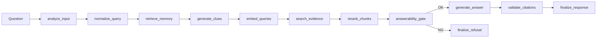

# MemoRAG MVP アーキテクチャ設計

- ファイル: `memorag-bedrock-mvp/docs/ARCHITECTURE.md`
- 種別: `ARC_VIEW`
- 作成日: 2026-05-01
- 状態: Draft

## 何を書く場所か

MVP の実行構成、主要コンポーネント、データ配置、実行フローを定義する。

## システムコンテキスト

```mermaid
flowchart TB
  User[Browser User] --> CF[CloudFront]
  Bench[Benchmark CLI] --> Api[API Gateway]
  CF --> Web[S3 Frontend Assets]
  User --> Api
  Api --> Fn[Lambda API (Hono + LangGraph)]
  Fn --> Bedrock[Amazon Bedrock]
  Fn --> S3Doc[S3 Documents Bucket]
  Fn --> VMem[S3 Vectors memory-index]
  Fn --> VEv[S3 Vectors evidence-index]
```

## 実行フロー（RAG）



## コンポーネント責務

- API Gateway: `GET/POST/DELETE` エンドポイント公開
- Lambda `ApiFunction`: API ハンドリング、RAG 実行、debug trace 永続化
- Bedrock: clue 生成・回答生成・embedding
- S3 Documents: source / manifest / debug-runs 保管
- S3 Vectors: memory-index / evidence-index ベクトル検索
- CloudFront + FrontendBucket: UI 配信

## データ配置

| データ | AWS | ローカル |
| --- | --- | --- |
| source | `documents/<documentId>/source.txt` | `.local-data/documents/<documentId>/source.txt` |
| manifest | `manifests/<documentId>.json` | `.local-data/manifests/<documentId>.json` |
| debug trace | `debug-runs/<yyyy-mm-dd>/<runId>.json` | `.local-data/debug-runs/<yyyy-mm-dd>/<runId>.json` |
| memory vectors | `memory-index` | `.local-data/memory-vectors.json` |
| evidence vectors | `evidence-index` | `.local-data/evidence-vectors.json` |

## API サーフェス

- `GET /health`
- `GET /openapi.json`
- `GET /documents`
- `POST /documents`
- `DELETE /documents/{documentId}`
- `POST /chat`
- `GET /debug-runs`
- `GET /debug-runs/{runId}`
- `POST /benchmark/query`

## 設計上の決定

1. サーバレス優先: 固定費抑制のため OpenSearch / RDS / ECS を採用しない。
2. S3 Vectors 優先: MVP で運用負荷を抑える。
3. no-answer 制御: retrieval guard / answerability gate / citation guard の 3 段で根拠不足回答を抑止。
4. debug trace 永続化: `includeDebug=true` 時のみ保存し調査可能性を担保。
