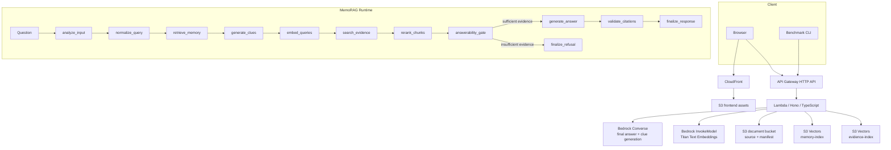

# Architecture Notes

## AWS serverless MVP

## LangGraph workflow

`@langchain/langgraph` は自律エージェントではなく、固定RAGパイプラインの実行基盤として使います。GraphのStateには正規化クエリ、memory hits、clues、retrieved/selected chunks、answerability、citations、debug traceを保持し、各Nodeの実行結果をUI/APIのdebug stepに変換します。

重要な分岐は `answerability_gate` です。ここでチャンクなし、スコア不足、金額・期限・申請方法などの必須事実不足を判定し、不十分なら `generate_answer` を呼ばずに `資料からは回答できません。` を返します。

## Why S3 Vectors first

- サーバやクラスター管理が不要。
- 初期検証ではOpenSearchやAurora Serverlessより固定費を抑えやすい。
- APIから `PutVectors` / `QueryVectors` / `DeleteVectors` を直接使えるため、RAGベンチマークの計測ポイントをアプリ側に置ける。

## No-answer control

MVPでは次の3段階で回答拒否します。

1. Retrieval guard: top hit score が `minScore` 未満なら即 no-answer。
2. Answerability gate: 必須事実のカバレッジが足りない場合はBedrock回答生成をskip。
3. Citation guard: final answerの `usedChunkIds` が選定chunkに紐づかない場合は no-answer。

本番では、Bedrock Guardrails、別モデルjudge、chunk-level entailment、回答文の引用span検証を追加すると安全性を高められます。
