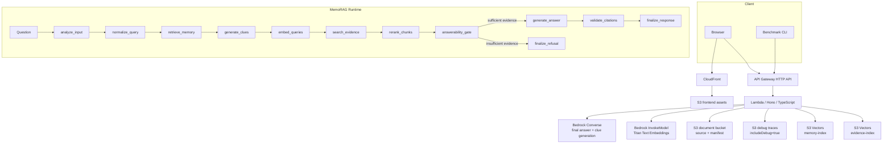

# Architecture Notes

## AWS serverless MVP

## Deployed AWS resources

CDK stack `MemoRagMvpStack` creates the following resources for the MVP.

| Resource | Logical role | Design note |
| --- | --- | --- |
| S3 bucket `DocumentsBucket` | Uploaded source text, document manifests, persisted debug traces | S3 managed encryption, block public access, SSL enforcement, server access logging to `AccessLogsBucket`; MVP uses `DESTROY` and `autoDeleteObjects`. |
| S3 bucket `FrontendBucket` | Static web UI assets and generated `config.json` | Private bucket accessed through CloudFront Origin Access Control. |
| S3 bucket `AccessLogsBucket` | S3 server access logs and CloudFront standard logs | 90-day lifecycle expiration; logging to itself is intentionally disabled to avoid recursive logs. |
| S3 Vectors bucket | Vector bucket named `memorag-<account>-<region>-<suffix>` | Created by custom resource because L2 CDK support is not used in this MVP. |
| S3 Vectors index `memory-index` | Memory card vectors | Dimension is controlled by CDK context `embeddingDimensions`; default `1024`. |
| S3 Vectors index `evidence-index` | Document chunk vectors | Same dimension and cosine distance as memory index. |
| Lambda `ApiFunction` | Hono API and MemoRAG workflow runtime | Node.js 22, ARM64, 1024 MB, 60-second timeout. |
| Lambda `S3VectorsProviderFn` | Custom resource provider for S3 Vectors bucket/index lifecycle | Node.js 22, ARM64, 2-minute timeout. |
| API Gateway HTTP API | Public JSON API | CORS allows `GET`, `POST`, `DELETE`, `OPTIONS`; no auth in MVP. |
| CloudFront distribution | Public web UI endpoint | Default root `index.html`, HTTPS redirect, SPA 403/404 fallback to `index.html`, access logging enabled. |
| CloudWatch Log Groups | Lambda logs, custom resource logs, API Gateway access logs | Retention is one week; all are destroyed with the stack. |
| IAM policies/roles | Lambda execution and service access | App Lambda can read/write document S3, invoke Bedrock, and call S3 Vectors APIs. Wildcards remain for Bedrock model ARNs and S3 Vectors MVP limitations. |
| CDK BucketDeployment provider | Optional frontend asset deployment and CloudFront invalidation | Runs when `apps/web/dist` exists or `includeFrontendDeployment` is set. |

The stack outputs `ApiUrl`, `OpenApiUrl`, `FrontendUrl`, `VectorBucketName`, index names, and `DocumentsBucketName`.

## Runtime storage layout

Production mode uses S3 and S3 Vectors. Local mode uses `.local-data` files and Bedrock mocks when `MOCK_BEDROCK=true`.

| Data | Production location | Local location |
| --- | --- | --- |
| Source text | `s3://<DocumentsBucket>/documents/<documentId>/source.txt` | `.local-data/documents/<documentId>/source.txt` |
| Manifest | `s3://<DocumentsBucket>/manifests/<documentId>.json` | `.local-data/manifests/<documentId>.json` |
| Debug trace | `s3://<DocumentsBucket>/debug-runs/<yyyy-mm-dd>/<runId>.json` | `.local-data/debug-runs/<yyyy-mm-dd>/<runId>.json` |
| Memory vectors | S3 Vectors `memory-index` | `.local-data/memory-vectors.json` |
| Evidence vectors | S3 Vectors `evidence-index` | `.local-data/evidence-vectors.json` |

## LangGraph workflow

`@langchain/langgraph` は自律エージェントではなく、固定RAGパイプラインの実行基盤として使います。GraphのStateには正規化クエリ、memory hits、clues、retrieved/selected chunks、answerability、citations、debug traceを保持し、各Nodeの実行結果をUI/APIのdebug stepに変換します。

重要な分岐は `answerability_gate` です。ここでチャンクなし、スコア不足、金額・期限・申請方法などの必須事実不足を判定し、不十分なら `generate_answer` を呼ばずに `資料からは回答できません。` を返します。

実行時パラメータは `/chat` と `/benchmark/query` で指定できます。既定値は `modelId=amazon.nova-lite-v1:0`、`embeddingModelId=amazon.titan-embed-text-v2:0`、`clueModelId=modelIdまたはDEFAULT_MEMORY_MODEL_ID`、`topK=6`、`memoryTopK=4`、`minScore=0.20`、`strictGrounded=true`、`useMemory=true` です。

`includeDebug=true` または `debug=true` の場合、Graph実行後に debug trace を永続化します。UIは `/debug-runs` と `/debug-runs/{runId}` から過去のtraceを取得し、各nodeのlatency、modelId、hit count、token概算、詳細ログを表示できます。

## API surface

| Endpoint | Purpose |
| --- | --- |
| `GET /health` | API health check. |
| `GET /openapi.json` | OpenAPI 3.0 document. |
| `GET /documents` | Ingested document manifest list. |
| `POST /documents` | Text/base64 document ingestion, chunk creation, memory card generation, vector registration. |
| `DELETE /documents/{documentId}` | Delete source, manifest, memory vectors, and evidence vectors for one document. |
| `POST /chat` | Grounded QA workflow. |
| `GET /debug-runs` | Persisted debug trace list. |
| `GET /debug-runs/{runId}` | One persisted debug trace. |
| `POST /benchmark/query` | Benchmark wrapper around `/chat`; defaults `includeDebug=true`. |

## Why S3 Vectors first

- サーバやクラスター管理が不要。
- 初期検証ではOpenSearchやAurora Serverlessより固定費を抑えやすい。
- APIから `PutVectors` / `QueryVectors` / `DeleteVectors` を直接使えるため、RAGベンチマークの計測ポイントをアプリ側に置ける。

## No-answer control

MVPでは次の3段階で回答拒否します。

1. Retrieval guard: top hit score が `minScore` 未満なら即 no-answer。
2. Answerability gate: 必須事実のカバレッジが足りない場合はBedrock回答生成をskip。
3. Citation guard: final answerの `usedChunkIds` が選定chunkに紐づかない場合は no-answer。

本番では、Bedrock Guardrails、別モデルjudge、chunk-level entailment、回答文の引用span検証を追加すると安全性を高められます。

## Cost design

The MVP is intentionally serverless. There is no NAT Gateway, RDS, OpenSearch, ECS, or provisioned Bedrock throughput in the baseline, so idle fixed cost is low. Monthly cost is dominated by Bedrock tokens, CloudWatch Logs ingestion, CloudFront transfer, and debug/log retention volume.

Pricing assumptions as of 2026-04-30:

| Service | Unit used for estimate | Tokyo price used |
| --- | --- | --- |
| Amazon Nova Lite | Input tokens | `$0.000072 / 1K tokens` |
| Amazon Nova Lite | Output tokens | `$0.000288 / 1K tokens` |
| Titan Text Embeddings V2 | Input tokens | `$0.000029 / 1K tokens` |
| AWS Lambda ARM | Duration | `$0.0000133334 / GB-second` |
| AWS Lambda | Requests | `$0.20 / 1M requests` |
| API Gateway HTTP API | Requests | `$1.29 / 1M requests` |
| S3 Standard | Storage | `$0.025 / GB-month` |
| S3 Vectors | Storage | `$0.066 / GB-month` |
| S3 Vectors | QueryVectors requests | `$0.0027 / 1K requests` |
| CloudWatch Logs | Ingestion | `$0.76 / GB` |
| CloudWatch Logs | Storage | `$0.033 / GB-month` |
| CloudFront Japan | Data transfer out | `$0.114 / GB` |
| CloudFront Japan | HTTPS GET/HEAD requests | `$0.012 / 10K requests` |

Baseline monthly scenarios excluding tax and AWS Free Tier:

| Scenario | Workload assumption | Estimated monthly cost |
| --- | --- | --- |
| Small validation | 100 documents, 1,000 chat requests, 1 GB logs, 1 GB CloudFront transfer | `$2-5` |
| Internal MVP | 1,000 documents, 10,000 chat requests, 10 GB logs, 20 GB CloudFront transfer | `$25-35` |
| Active pilot | 10,000 documents, 100,000 chat requests, 100 GB logs, 200 GB CloudFront transfer | `$200-250` |

Per-chat cost is usually around `$0.001` with default settings because a successful answer uses two Nova Lite calls (`generate_clues`, `generate_answer`), multiple Titan embedding calls, and multiple S3 Vectors queries. No-answer paths are cheaper because `generate_answer` is skipped after `answerability_gate`.

Cost controls:

- Keep `topK` and `memoryTopK` at the default unless retrieval quality requires more.
- Avoid enabling `includeDebug` for all production traffic; debug traces increase S3 storage and CloudWatch log volume.
- Keep CloudWatch log retention short for MVP; the stack uses one week.
- Prefer S3 Vectors for MVP vector search to avoid OpenSearch/Aurora fixed capacity.
- Revisit `embeddingDimensions` before production data load because S3 Vectors index dimensions cannot be changed in place.

Primary pricing sources: AWS public pricing pages and AWS Price List API for Amazon Bedrock, AWS Lambda, Amazon API Gateway, Amazon S3/S3 Vectors, Amazon CloudFront, and Amazon CloudWatch.
