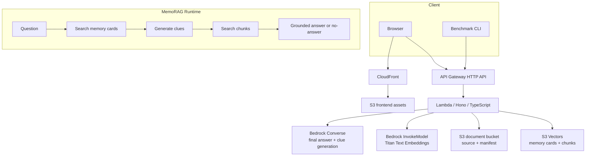

# Architecture Notes

## AWS serverless MVP

## Why S3 Vectors first

- サーバやクラスター管理が不要。
- 初期検証ではOpenSearchやAurora Serverlessより固定費を抑えやすい。
- APIから `PutVectors` / `QueryVectors` / `DeleteVectors` を直接使えるため、RAGベンチマークの計測ポイントをアプリ側に置ける。

## No-answer control

MVPでは次の2段階で回答拒否します。

1. Retrieval guard: top hit score が `minScore` 未満なら即 no-answer。
2. Generation guard: final promptでJSON `isAnswerable=false` を許可し、資料外推測を禁止。

本番では、Bedrock Guardrails、別モデルjudge、chunk-level entailment、回答文の引用span検証を追加すると安全性を高められます。
